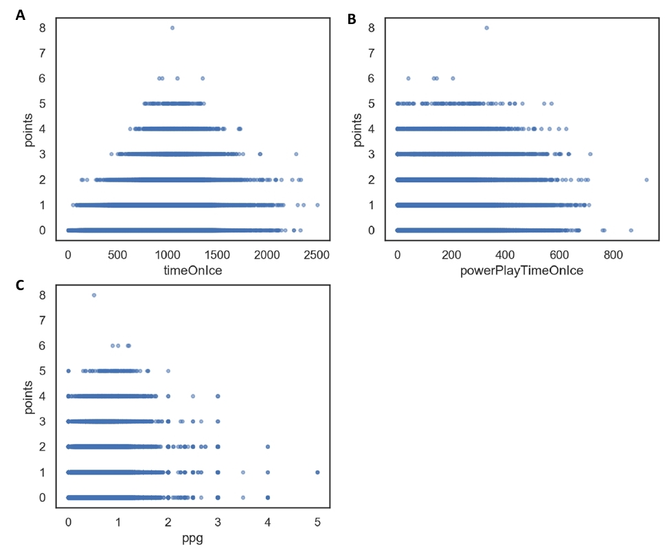
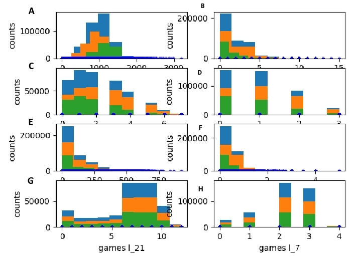
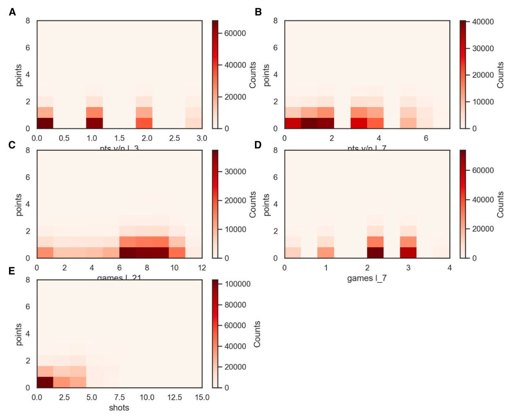
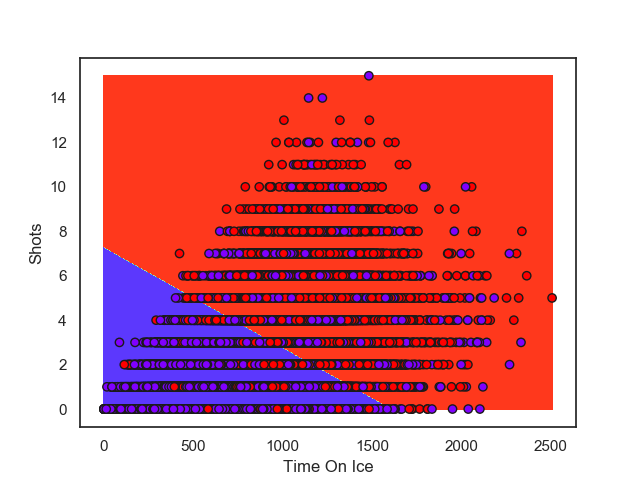
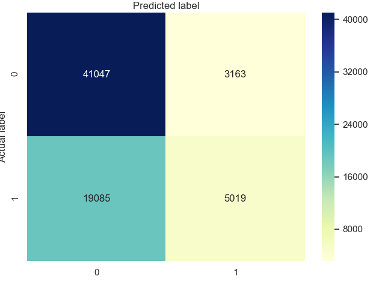

# Player Point Predictor

# Instructions 

## Libraries Needed

import numpy as np

import pandas as pd

import sys

from sklearn.model_selection import train_test_split

from sklearn.pipeline import make_pipeline

from sklearn.preprocessing import MinMaxScaler

from sklearn.model_selection import GridSearchCV

from sklearn.neighbors import KNeighborsClassifier

from sklearn.svm import SVC

from sklearn.decomposition import PCA

from matplotlib import cm

import matplotlib.pyplot as plt

from sklearn import metrics

import seaborn as sns

import os.path

import os

from datetime import date, timedelta, datetime

from scipy import stats

## How to Run the Scripts

1) In 01-extract.py we need to input 4 parameters on command line.
    
    **python3 01-extract.py game_skater_stats.csv, player_info.csv, game.csv, player_complete**

2) In 02-filter.py we need to input 2 parameters, first is name of csv created from step 1 and second is the name of the new csv created
    
    **python3 02-filter.py player_complete.csv final.csv**

3) In 03-feature-engineering.py we need to input 1 parameter, the name of the csv from step 2
    
    **python3 03-feature-engineering.py final**

4) In 04-visualize.py we need to input 1 parameter, the name of the csv from step 2
    
    **python3 04-visualize.py final.csv**

5) In 05-create_model.py we need to input 1 parameter, the name of the csv from step 2
    
    **python3 05-create_model.py final.csv**

## Data

All data used in the project came from a user on Kaggle1.

## Question

##### Can we predict if a player will get a point in a match based off of past performance.

## Getting Results

The project utilizes statistical methods, machine learning tools and computer science to answer the question. Correlative statistics is used to determine what features are the most statistically relevant to the answer. The Support Vector Classifier (SVC) is used to predict whether a player gets a point.

## Data Analysis

A skater is defined as any player that is not a goalie. A filter stage filtered out skaters who had not played any games or had no game data. The dataset is further filtered for skaters who were non-defenseman, leaving only forwards.

Preliminary Analysis of the dataset consisted of production of histograms to identify potential outliers, scatterplots for visualization of the datasets.

New variables that are based off of the given dataset were created in attempt to create more meaningful relationships between the data.

Scatterplot and correlation analyses are done to identify which features are to be used in the machine learning model. Predictin whether a player gets a point is a binary classification problem, where 1 means a player gets a point and 0 means a player does not get a point. SVC was then chosen to make our predictions. The dataset is split into a 3:1 (or is it 4:1) ratio corresponding to a training:testing dataset. MinMaxScaler() was also used so that the features would be on the same scale.

The features chosen for the final model are:

| feature | r2 |
| ------ | ------ |
| timeOnIce (TOI) | 0.286 |
| shots | 0.318 | 
| powerPlayTimeOnIce (ppTOI) | 0.252 | 
| points per game (ppg) | 0.273 | 

GridSearchCV() was used to efficiently determine the optimal parameters for the SVC model. 

Scatterplots           |
:-------------------------:|
|  |
| Scatterplots of forward’s features. A) timeOnIce vs points correlation = 0.286. B) ppg vs points correlation = 0.272. C) powerPlayTimeOnIce vs points correlation = 0.252. |

Histograms           |
:-------------------------:|
|  |
| Histograms all skaters Blue distribution is all skaters (forwards + defenseman), orange distribution is only forwards, green distribution is only defenseman. A) timeOnIce. B) shots. C) pts y/n l_7. D) pts y/n l_3. E) powerPlayTimeOnIce. F) ppg. G) games l_21. H) games l_7 |

Heatmaps           |
:-------------------------:|
|  |
| Heatmap of forwards’ features. A) pts y/n l_3 vs points correlation = 0.173. B) pts y/n l_7 vs points correlation = 0.217. C) games l_21 vs points correlation = 0.0579. D) games l_7 vs points correlation = 0.0393. E) shots vs points correlation = 0.312. |

## Results

A value of C = 4 with a linear kernel was determined to be the optimal parameter for the dataset. The model achieved a training score of 0.676 and a testing score of 0.676.  A Confusion matrix was also created to aid with the visual representation of false positives and false negatives.

SVC Model           |  Confusion Matrix
:-------------------------:|:-------------------------:
|  |  
| Visual Representation of SVC model with C = 4 and kernel = linear. Training Score = 0.676, testing score = 0.676. | Total predictions = 68314. Correct predictions: category 0 (no points) = 41047 Top left, category 1 (points) = 5019 bottom right.  False negatives (bottom left) = 19085, False positives (top right) = 3163| 

## Discussion

For our model’s features, we analyzed time on ice (timeOnIce), shots, power play time on ice (powerPlayTimeOnIce), points per game (ppg), number of games in the last seven in which a player received at least a point (pts y/n l_7), number of games in the last three in which a player received at least a point (pts y/n l_3), number of games in the last twenty one days (games l_21), and number of games in the last seven days (games l_7) (Table 1, Appendix I-III). Of the features that we manually engineered, only ppg had improved our model (score = 0.658 without vs score = 0.676 with). Although pts y/n l_7 and pts y/n l_3 appeared to have a positively correlated association with points, the model could not create a decision boundary when they were both included – so they were removed. Because of games l_21 and game l_7’s very weak positive correlation with points, we opted not to use them. It was hypothesized that perhaps a better prediction could be made if the model could capture more subtle aspects of player performance: phenomenon such as momentum/point streaks, consistency, and fatigue. Specifically, the feature pts y/n l_x (x = number of games) was meant to track if a player was on a point streak. The more games a player had with points, the more likely he was on a hot streak, and therefore they could ride their momentum into the next game. Ppg was a feature meant to track a player’s consistency. The more points a player had per game could indicate how likely the player is to get a point in the next game – a player with a higher ppg is more likely than a player with a lower ppg. Finally, games l_d (games in the last d days) was meant to represent how fatigued a player could be. It was hypothesized that a player who plays more games in the last d days would be more fatigued than another player who has played less games over those same d days. This could result in a poorer player performance for the game being predicted. 
Here lies a limitation to our model: we assumed that all features had a linear relationship with points. However, in the absence of a linear relationship (~ 0 correlation) – such as games l_d – there could be a more sophisticated relationship between fatigue and points: one that is not linear. 

As mentioned, the model has a training score of 0.676 and a test score of 0.676. The support vector classifier was used, given that in Figure 1 there appears to be an almost linear decision boundary between games that had a player get a point versus those that did not. Thus, we decided to use SVC with the linear kernel. We optimized for our penalization parameter, C, and found that the model had the highest accuracy at C = 4. While it could be argued that another classifier such as K nearest neighbors could be used, we noticed superior accuracy for SVC over knn. In Figure 1, it is difficult to discern if the categories 0 or 1 (games with a point vs games without a point) are in fact different groups. From Figure 1, it does not appear that they are distinctly different, given the overlap. However, it would be remiss not to draw attention to the fact that at the extremes of both the purple group (games with a point) and red group (games without a point) (bottom left quarter vs top right corner, respectively) there is unequivocally more purple dots compared to red. Similarly, in the upper right quarter, there are much more red dots than purple. Also, from Figure 1 and 2 it certainly appears that the model more accurately predicts whether a player does not get a point. A possible explanation for this is that if a player has a lower time on ice, lower shots per game, and lower power play time on ice he will certainly have less opportunity to score. However, the opposite may strictly not be true. If a player has more time on ice, more shots per game, and more power play time on ice, this does not necessarily guarantee that he will get a point or that he is improving his opportunities of scoring. This can be highlighted by the more subtle aspects when analyzing these features. For instance: how much time on ice is the player playing in the offensive zone? Where is the player taking his shots from? Or how good is a team’s power play? Fundamentally, this is a quality versus quantity argument per se. Thus, while we have naively assumed that points linearly correlate with our chosen features, this may not be entirely true.

Another limitation to our prediction is that we use every forwards’ data to create one model, as opposed to creating a separate model for each player. In theory, a model for each player would be more finely tuned for the changes in values for each feature and could create a model that is player-specific. For instance, take two individual models for player X and player Y: call them model X and model Y. Now suppose that for player X, changes in time on ice correlates more positively to points compared to player Y. Simply put, if player X and player Y play the same amount of time, player X is more likely to get a point as opposed to player Y. However, our model assumes that all correlations between features and points is uniform. Therefore, if we strictly had testing/holdout data for a specific player, and we used our model to predict whether a specific player was going to get a point in any number of the testing/holdout games we may get more or less than 0.676 (our model’s testing score).

As an aside, another significant limitation of our prediction is that we predict whether a player gets a point based on data for features that already exist. Specifically: if we truly wanted a model that could make predictions, we would need to use values for features that did not already exist. Likely, we would need much more advanced techniques such as forecasting and time series analysis to make our predictions. 

The prediction of whether a player gets a point in a certain game is tantalizing for any hockey enthusiast. If a model can accurately and reliably make such a prediction, such information can give an advantage to any analyst. Yet, it should be clear that these findings are not without their limitations. These findings should be taken at face value and it would be optimistic, even naïve, to expect accurate and precise predictions without drastic improvements and refinements to the model.

## References

1.	Kaggle. (2018) NHL Game Data Game, team, player and plays information including x,y coordinates. Retrieved from https://www.kaggle.com/martinellis/nhl-game-data
